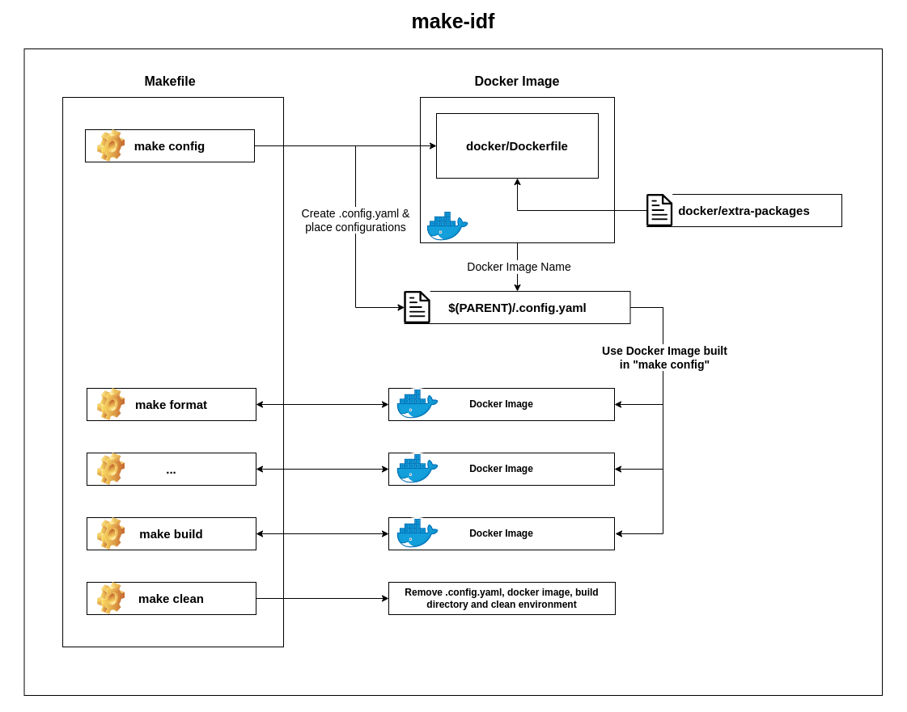

# IDF Test and Build

## Introduction
Developer spend most of their times setting up development environment, this process entails the installation of various utilities, dependencies, and other requisite components on their HOST machines. Setting up all this is very hectic for a new developer causing uncessary bottlenecks in both the developement and learning. 

This solution streamlines the process, requiring developers solely to install and configure Docker on their host machines. The ensuing automation and orchestration of tasks are seamlessly handled by the provided Makefile with integrated docker.

## Getting Started
A Makefile have different targets — the functionalities provided by the Makefile, target to build, target to test etc.
`This repo will be added to all the idf projects are a submodule.` Developer need to create a Makefile as shown below in the project's `PARENT` directory that Makefile will include the Makefile in this repo and call targets on this. Makefile in project's `PARENT` directory will look somethings like this;

```sh
include make-idf/Makefile

help: help

config: config

build: build

test: test

format: format

cppcheck: cppcheck

clean: clean

```

You can check the available targets by running the below command in the project's `PARENT` directory:

```sh
$ make help
Available make Target Options:
  - help:                          Show Help
  - config:                        Configure Project & Install Project Dependencies
    - version=<idf-version>        idf-version: 4.4 ( Default )
    - port=<flash-port>            port: ttyUSB0 ( Default )
  - format:                        Format Source Code Files
  - cppcheck:                      Apply CppCheck
  - build:                         Compile/Build Project
  - flash:                         Flash Executable
  - test:                          Run Tests
  - clean:                         Remove Compiled Files

USAGE:
  - '$ make' OR '$ make build'
  - '$ make config version=5.1 port=ttyUSBxxx'

NOTE:
  - To stop build started by make, Please press CTRL + z
  - Configure the project as per your requirements or use the default settings
  - Please use ROOT priviliges, if docker is configured/installed by ROOT USER
```
**IMPORTANT:**  `Read the "NOTE" section in help carefully!`
## Setting Development Environment


## Usage
1. First of all, developer have to configure the project as per development requirements, like setting idf version and port that will be used.
    - To configure, the project run one of the below commands. That commands will creat a hidden file `.config.yaml` with your preferred configurations
    - It'll also build a new docker image with all the required packages that'll be required in development.
```sh
$ make config
# OR
$ make config version=5.1
# OR
$ make config version=5.1 port=ttyACM0
```
2. Now, developer can call any of the make targets as given below. All the targets after configuration use docker image build in step 1.

```sh
# Formatting Source Code
$ make format
# Static Code Analysis
$ make cppcheck
# Build
$ make
# OR
$ make build
```